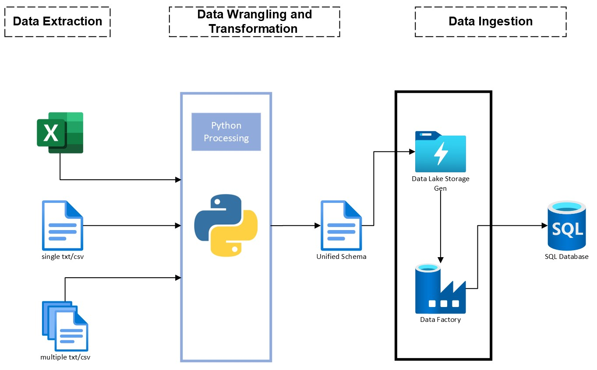

# Transforming-Data-Using-Pandas-in-Python

## Overview
The project delivered an automated solution to process commission statement files for the finance team, streamlining their monthly reporting to the C-suite. It also served the sales/operations department by driving strategy with processed data insights. The automation handled a variety of data formats from over five carriers and integrated with Power BI for data modeling and reporting, incorporating financial metrics and spend analysis by media channel.

## Visual Process Overview

## Technologies and Tools Used
Python: Utilized for scripting the preprocessing and transformation of data files.
Pandas: Employed for advanced data manipulation tasks.
Azure Data Factory: Orchestrated the data workflow, handling the execution of Python scripts and refreshing Power BI datasets.
Power BI: Served as the platform for creating the data model and generating insightful reports for strategic decision-making.
SQL Server: Hosted the final data model used for comprehensive reporting and analysis.

## Problem Statement
The project addressed the challenge faced by the finance and sales/operations teams in manually processing commission statements. The task was laborious and susceptible to human error, with each carrier presenting data in different formats.

## Solution Framework
A Python-based automation tool was developed, leveraging Pandas for data wrangling and OS modules for file operations. The solution provided:

Adaptive Data Processing: Customized to handle varying data formats and requirements from multiple carriers.
Quality Checkpoints: Included header validation and data consistency checks, coupled with error logging and handling for data integrity assurance.
Data Factory Integration: Automated the execution of Python scripts and refreshed the Power BI data model, maintaining up-to-date reporting.

## Impact
The automation tool revolutionized the commission statement processing by:

Improving Efficiency: It eliminated the need for manual data processing, saving substantial time and resources.
Enhancing Data Quality: By automating data validation and consistency checks, the tool improved the accuracy of financial reporting.
Supporting Strategic Decision-Making: The finance team was able to produce reliable reports for the C-suite, while sales/operations used the data to refine their strategies.
Usage
The Power BI report is the entry point for users to interact with processed data. The finance team utilizes this for daily metrics reporting, while the sales/operations departments derive actionable insights for strategic planning.

## Conclusion
The development of the Dynamic Automation tool has proven to be an indispensable asset for the enterprise, particularly in empowering the finance team with the agility to produce daily C-suite metrics and enabling the sales/operations department to craft data-driven strategies.
